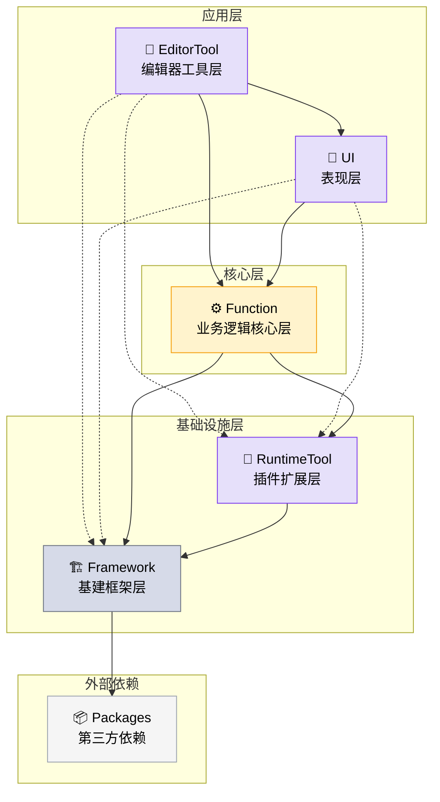

<h1 align="center">🎮 GameDev-Structure</h1>

<p align="center">
  <b>Game Development Project File Structure</b><br>
  <sub>游戏开发项目文件结构示例模版</sub>
</p>

<p align="center">
  采用模块化、分层设计理念，确保代码的 <b>可维护性</b> 和 <b>可复用性</b>。
</p>

---

## 📋 设计原则

### 🏗️ 架构原则
- **分层架构** — 自上而下单向依赖，杜绝循环引用
- **模块化** — 按功能模块划分，便于团队协作
- **高内聚低耦合** — 按技术职责划分，UI 按场景组织

### 🔧 工程原则
- **编译期分离** — Editor / Runtime 严格隔离，减小包体
- **可复用性** — Framework、EditorTool、RuntimeTool 可跨项目复用
- **可扩展性** — 插件化设计，支持动态扩展

### 📊 数据流分层

Config（配置表结构） → Data（运行时数据结构） → DataService（数据绑定） → Service（业务逻辑）

> 符合 MVVM / MVP 设计模式，DataService 作为 ViewModel 层，实现数据与表现的分离。

---

## 📁 分类定义

### 核心目录

| 目录名称 | 描述 | 定位 | 职责 |
|---------|------|------|------|
| **Framework** | 基础框架 | 换项目依旧可以使用的基建代码 | 提供基础架构、通用工具类、核心系统等 |
| **Function** | 业务功能 | 换了引擎或UI表现依旧可以使用的业务逻辑 | 实现具体业务功能，如用户管理、经济系统、成就系统、任务系统等 |
| **EditorTool** | 编辑器效率工具 | 换了项目依旧可以使用的编辑器工具 | 资源的自动化处理、快速创建字体资源、网络环境配置等 |
| **RuntimeTool** | 自增插件性功能 | 换了项目依旧可以使用的运行时插件 | 自定义扩展的UI控件、UI特效、红点管理系统、访问非Unity文件路径等 |
| **UI** | 用户界面 | 游戏的用户界面实现 | 处理游戏中的界面展示、交互逻辑等 |
| **Plugins** | 第三方插件工具 | 手动导入的第三方插件 | 提供外部依赖功能 |
| **Packages** | 第三方插件工具 | 通过依赖包管理器导入 | 提供外部依赖功能 |
| **Resources** | 资源文件 | 游戏专属资源 | 存储模型、材质、音效、UI资源等 |

---

## 📂 详细目录结构

<details open>
<summary><b>点击展开/收起完整目录树</b></summary>

```
Game-Project-Structure/
├── Assets/
│   ├── Plugins/                           # 第三方插件工具（手动导入）
│   ├── Framework/                         # 框架代码
│   │   └── SampleXXX/                     # 某某框架内容
│   │       ├── Editor/
│   │       └── Runtime/
│   ├── RuntimeTool/                       # 自增插件性功能
│   │   └── SampleXXX/                     # 某某自增插件
│   │       ├── Editor/
│   │       └── Runtime/
│   ├── EditorTool/                        # 编辑器效率工具
│   │   └── SampleXXX/                     # 某某工具
│   │       └── Editor/                    
│   ├── Scripts/                           # 游戏专属代码
│   │   ├── Function/                      # 业务功能代码
│   │   │   └── SampleXXX/                 # 某某业务功能
│   │   │       ├── Editor/
│   │   │       └── Runtime/
│   │   │           ├── AccessBus/         # 事件/命令总线（外部可访问）
│   │   │           ├── Config/            # 配置表数据结构
│   │   │           ├── Data/              # 业务功能数据结构
│   │   │           ├── DataService/       # 数据绑定服务（外部可访问）
│   │   │           ├── GlobalListener/    # 始终运行的全局监听，接收网络同步事件等
│   │   │           ├── LuaPlugin~/        # 网络服务器热更代码
│   │   │           ├── Prewarm/           # 游戏启动预热初始化
│   │   │           ├── Save/              # 数据保存至本地或云端服务器
│   │   │           ├── Server/            # 对接服务端
│   │   │           ├── Service/           # 业务逻辑方法（外部可访问）
│   │   │           └── XXXManager.cs      # 该模块管理类（外部可访问）
│   │   └── UI/                            # UI相关代码
│   │       └── SampleSceneXXX/            # 按UI场景划分
│   │           ├── Config/                # UI配置表数据结构
│   │           ├── Input/                 # 玩家输入系统
│   │           ├── Panel/
│   │           │   └── PnlXXX/            # 某个UI界面
│   │           └── XXXJumpManager.cs      # UI跳转控制
│   ├── Resources/                         # 游戏专属资源
│   │   ├── Develop/                       # 开发版本
│   │   ├── Release/                       # 正式版本
│   │   │   ├── SampleEntityXXX/           # 实体对象，例如角色、美术场景、Boss等
│   │   │   │   ├── Common/                # 当前实体下的通用资源
│   │   │   │   │   ├── Anime/             # 动画
│   │   │   │   │   ├── Audio/             # 音效
│   │   │   │   │   └── Config/            # 配置表数据
│   │   │   │   └── SampleIndividualXXX/   # 个体对象，例如角色A、美术场景A、BossA等
│   │   │   │       ├── Anime/             # 动画
│   │   │   │       ├── Audio/             # 音效
│   │   │   │       ├── Image/             # 静态图
│   │   │   │       ├── Material/          # 材质
│   │   │   │       └── Prefab/            # 预制体
│   │   │   └── UI/                        # UI资源
│   │   │       ├── Common/                # UI通用资源
│   │   │       │   ├── Anime/             # 动画
│   │   │       │   ├── Audio/             # 音效
│   │   │       │   └── Config/            # 配置表数据
│   │   │       └── SampleSceneXXX/        # UI场景
│   │   │           ├── Config/            # UI场景中的配置数据
│   │   │           └── Panel/             # UI面板
│   │   │               └── PnlXXX/        # 某个UI面板
├── Packages/                              # 第三方插件工具（依赖包导入）
├── .gitignore
└── README.md
```

</details>

---

## 🔄 程序集引用关系

采用**严格分层架构**，遵循**自上而下单向依赖**原则：



### 引用规则

| 规则 | 说明 | 图示 |
|------|------|:--:|
| **只能上引用下** | 上层可引用下层，禁止反向依赖，杜绝循环引用 | ⬇️ |
| **同层内依功能关系处理引用** | 同一层级内的模块间引用根据实际功能需求决定 | ↔️ |
